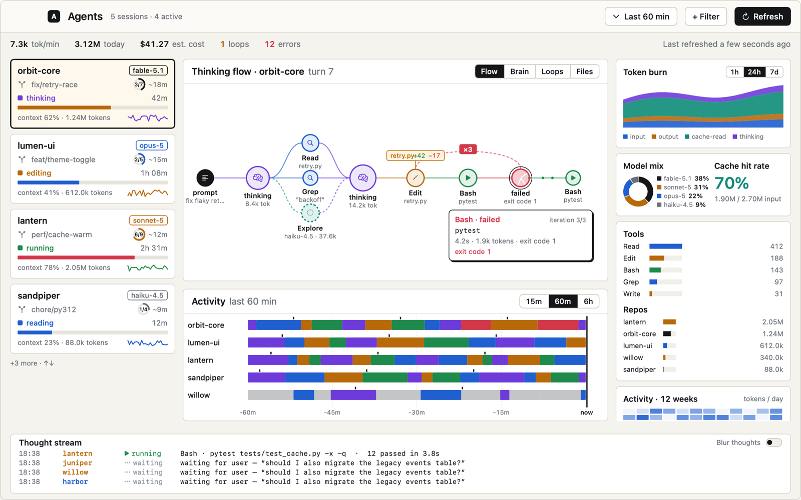
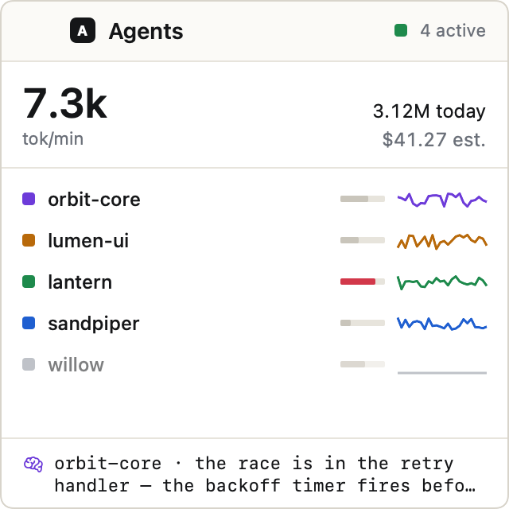
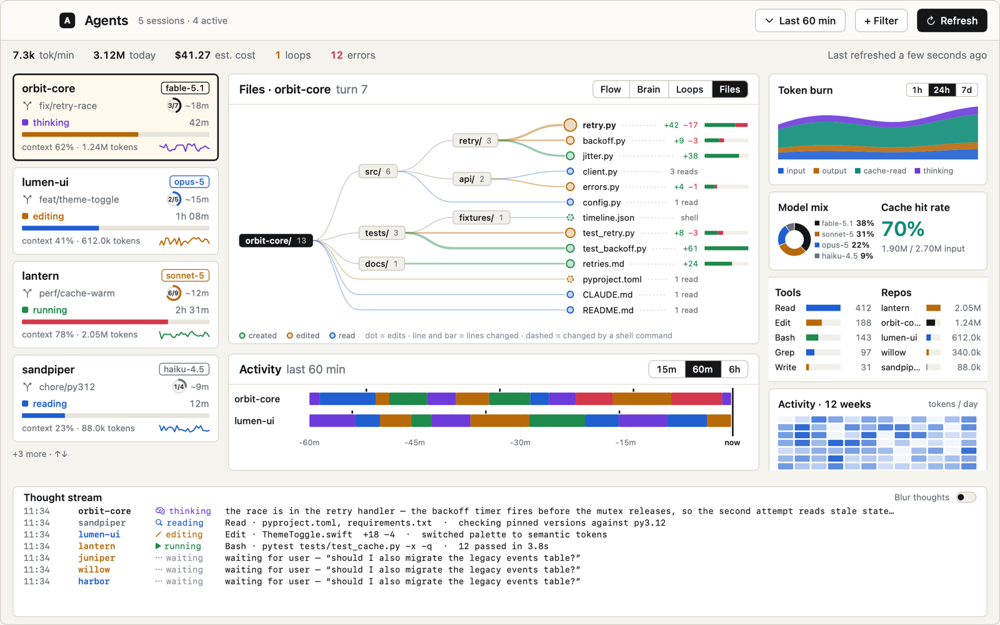

# Agent HUD

Mission control for your Claude Code sessions. An always-on-top widget that expands into a full
dashboard: what every agent is doing right now, the shape of the turn it is in, what it is burning,
and which ones are stuck in a loop.



It reads `~/.claude/sessions/*.json` and `~/.claude/projects/**/*.jsonl` and nothing else. **Strictly
local, read-only, no network, no API keys** — the app makes no outbound connections of any kind and
never writes into `~/.claude`. Its only output is a cache of its own in Application Support.

## Requirements

- macOS 14 (Sonoma) or newer
- Xcode 16+ (for the Swift 6 toolchain) — `xcode-select --install` is not enough, the full Xcode is needed
- [XcodeGen](https://github.com/yonaskolb/XcodeGen) — `brew install xcodegen`
- Claude Code, having run at least once (the HUD has nothing to show otherwise)

## Install

```bash
git clone https://github.com/easavin/agent-hud.git
cd agent-hud
xcodegen generate
xcodebuild -project AgentHUD.xcodeproj -scheme AgentHUD -derivedDataPath build build
open build/Build/Products/Debug/AgentHUD.app
```

That is the whole install. It builds ad-hoc signed, so no Apple Developer account is involved.

To keep it around, drag `build/Build/Products/Debug/AgentHUD.app` into `/Applications` — but move it
rather than copying. Two bundles with the same identifier both register with LaunchServices, and then
a Dock click can launch the stale one and you get two widgets on screen.

### First launch

Two things will ask for your permission, both expected:

- **"AgentHUD" is from an unidentified developer.** Ad-hoc signing, not notarization. Right-click the
  app → **Open** → **Open**, once.
- **Access to Documents / Desktop / Downloads.** The Files tab draws each session's working directory,
  so macOS gates the folder your repos live in. Denying it only blanks that one tab.

Ad-hoc signatures change on every build, so macOS treats each rebuild as a new app and re-asks for the
folder access. If you rebuild often, sign with your own Apple Development certificate instead: create
`Signing.local.xcconfig` (gitignored) next to `Signing.xcconfig` with

```
CODE_SIGN_IDENTITY = Apple Development
CODE_SIGN_STYLE = Manual
DEVELOPMENT_TEAM = YOURTEAMID
```

and the grant sticks across rebuilds. Your team ID is in the Membership tab of your Apple Developer
account, or from `security find-identity -v -p codesigning`.

### Try it without any sessions

```bash
./build/Build/Products/Debug/AgentHUD.app/Contents/MacOS/AgentHUD --demo busy
```

`--demo` takes `busy`, `idle` or `alert` and shows a sample fleet instead of your real sessions —
useful for seeing the whole interface at once. (The flags need the executable inside the bundle;
`open` does not forward arguments.)

The same binary takes `--snapshot <dir> [--demo …]`, which renders every frame to PNG and quits, with
no screen-recording permission needed. **Without `--demo` those PNGs contain your real prompts, file
paths and repo names**, so `snapshots/` and `shots/` are gitignored; keep it that way.

## Using it



The app lives in three sizes. The **widget** (320×320) floats above everything; the **mini** widget
(160×160) is the same thing shrunk to a pulse and a token rate; the **dashboard** (1280×800, freely
resizable) is the full view. It is a regular Dock app, and the Dock icon itself is live — a block-bar
history plus current tok/min.

| | |
|---|---|
| Open the dashboard | Click the Dock icon, the widget's green light, or double-click the widget |
| Switch size | **⌘1** dashboard · **⌘2** widget · **⌘3** mini, or the widget's yellow light |
| Hide the widget | Its red light. The menu bar icon brings it back |
| Quit | **⌘Q**. Closing the dashboard alone leaves the widget running |

Inside the dashboard: `↑ ↓` select a session · `f` `b` `l` `s` switch the hero tab · `p` blurs the
thought stream for screen-sharing · `1` `2` `7` set the token-burn range. Clicking a node in the flow
graph opens its detail popover.

Every border between panes is draggable — the rail, the stats column, the flow/lanes split, the
thought stream — and the sizes persist. The window resizes freely with no locked aspect ratio:
nothing scales, the layout reflows.

### What the tabs show

- **Flow** — the current turn as a graph: prompt, thinking blocks, tool calls, results, subagents
  (dashed teal, carrying the agent type and the model that actually ran). A retry loop compresses to
  the latest iteration with a red `×N` on the edge; a turn longer than the canvas drops middle
  columns and says so.
- **Brain** — the context window by layer: what is filling it and how close to full.
- **Loops** — a radar of repeated failures, with the iteration that keeps coming back.
- **Files** — the session's working directory as a graph rather than a list. Folders branch left to
  right on curved links and every file lines up in one column: its dot is sized by edit count, its
  link and diff bar by lines changed, and a dashed ring marks a change made by a shell command
  rather than an Edit call.



### Things worth knowing

- Finished sessions stay in **Recent** for 3 days (max 8) and stay fully browsable. The widget, Dock
  tile and counters only ever count live sessions.
- **tok/min** is *output* tokens over the trailing minute; it reads zero for idle agents.
- **Cost** is an API list-price equivalent (`CostEstimator.prices`), not what a subscription bills you.
- The history index caches to `~/Library/Application Support/AgentHUD/index.json` — token totals,
  tool and repo names, no prompt text. Delete it to force a re-scan (~7s for 330 MB of transcripts).
- There is no **Interrupt** button, though the design handoff drew one: the app is read-only and has
  no business killing someone's session.

## Design

The interface is *light product-analytics*: a warm off-white canvas, flat white cards with 1px
warm-grey borders, dark-ink buttons and segmented controls, and saturated-but-muted semantic colors
that clear 4.5:1 on white. Everything is vector — node graphs, donut, radar, stacked areas,
sparklines, heatmap. No gradients, no glow, no shadows except the flow popover's hard 2px offset.

Motion is calm and scoped. The flow graph splits into a static layer (edges, nodes, labels, redrawn
only when the turn changes) and a motion layer that runs at 15 fps only while a tool is in flight.
Lanes redraw once a second. Reduce Motion drops both to their resting frame and leaves the data
updating.

Type is **IBM Plex Sans** when installed and the system face otherwise; code and the thought stream
use **JetBrains Mono**, falling back to SF Mono. Neither font is bundled.

## Repository layout

- **`Packages/HUDCore`** — all the logic, no UI, unit-tested with `swift test`: transcript parsing,
  incremental tailing, per-session state (activity, turn steps, loops, plan progress, context
  "brain"), the history index and cost estimate. `swift run hudctl [stats]` prints what the HUD sees,
  which is the fastest way to check ingest without launching the app.
- **`AgentHUD/Views/Light/`** — the entire interface.
  - `Theme.swift` — design tokens, type, radii. `Components.swift` — `Card`, `CardHeader`,
    `Segmented`, `ToolbarButton`, `ModelBadge`, `BarTrack`, `Sparkline`, `ProgressRing`.
  - `DashboardView.swift` — the frame, header, metrics strip, body grid, thought stream, keyboard.
  - `FlowLayout.swift` turns a turn's steps into positioned nodes and edges (pure geometry, no
    SwiftUI, independently testable); `FlowGraphView.swift` draws them.
  - `HeroTabs.swift` — brain graph and loop radar. `FileTreeLayout.swift` + `FilesView.swift` — the
    working directory graph.
  - `AgentCard.swift`, `LanesPanel.swift`, `StatsRail.swift`, `WidgetView.swift`, `DockTileView.swift`.
- **`design_handoff_agent_hud_light/`** — the design handoff this UI is built from (frame `3b`).
  `design_handoff_agent_hud_terminal/` (`3a`) and `design_handoff_agent_hud/` (the original neon
  direction, still the behavior reference for `1e` / `2a`) are the earlier explorations.
  `docs/design-prompt.md` is the prompt behind the first.

Anything with a shape of its own is a `Canvas`: the flow graph, brain graph, loop radar, lanes,
stacked-area burn chart, donut, heatmap. Cards, controls and text stay ordinary SwiftUI so they
hit-test and truncate properly. The dashboard window is **not** movable by its background: AppKit claims a mouse-down on any transparent area to
move the window before SwiftUI sees it, and the splitters are transparent, so every drag moved the window instead
of resizing. The header is the drag area instead (`WindowDragArea`).

Dragging updates `@State` and writes to `UserDefaults` once, on release: `@AppStorage` pushes every frame of a
drag through the defaults system and the whole dashboard re-renders with it. The stats rail picks its one- or
two-column layout from the width it is handed rather than with `ViewThatFits`, which re-measures mid-drag and
flickers, and the splitter holds its cursor for the length of a drag instead of swapping it as the handle slides
out from under the pointer.

Panes window their content rather than scrolling it — `ImageRenderer`
cannot draw a `ScrollView`, so `--snapshot` would come back blank for any pane that used one.

## Contributing

`swift test` in `Packages/HUDCore` covers the ingest and derivation layers; anything you add there
should come with a test. UI changes are checked against `--snapshot`, which renders every frame
including `dashboard-narrow-*` (1040×640) and `dashboard-wide-*` (1680×1000) so both ends of the
resize range stay verifiable.

Two invariants, please: the app never writes into `~/.claude`, and it never opens a network
connection.

## License

MIT — see [LICENSE](LICENSE).
